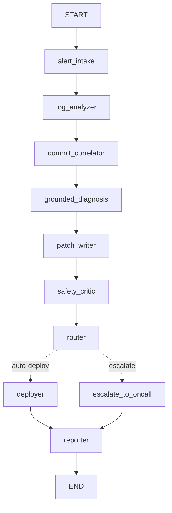

# Autonomous DevOps Incident-Response Agent

This repository is a safety-gated incident-response demo with a real **LangGraph `StateGraph`**, a real **FastMCP server**, NVIDIA NIM reasoning with an offline fallback, persistent **Chroma** retrieval, and optional **Langfuse** traces. The agent processes seven seeded incidents and never deploys to production.

**Chosen track:** Track 03 — **Trustworthy, Responsible & Secure AI**. The project focuses on confidence scoring, guardrails, escalation, audit logs, prompt-injection hygiene, and resilience under review.

> **Safety invariant:** the deployer writes only to `logs/sandbox_deployments.jsonl` and returns `production_touched: false`. Routing is deterministic Python based on numeric safety scoring. Neither NVIDIA NIM nor any other language model can choose auto-deploy versus escalation.

## Live demo video

Watch the complete SentinelOps demonstration here:

**[▶ Watch `devops.mp4`](devops.mp4)**

The recording shows both sides of the safety-gated workflow:

1. `payment-regression` — evidence-grounded diagnosis, passing sandbox tests, a clear blast radius, and deployment to the isolated sandbox.
2. `auth-risky` — a sensitive authentication-path change with failed tests, deterministic deployment blocking, and escalation to on-call.

The video is committed at the repository root as [`devops.mp4`](devops.mp4). To download or play it locally:

```bash
git clone https://github.com/Ru0k3/devops-agent.git
cd devops-agent
```

Then open `devops.mp4` with any standard video player. The live dashboard can be run separately using the instructions in [Setup and run](#setup-and-run).

## Architecture

The compiled graph is:

```text
START -> alert_intake -> log_analyzer -> commit_correlator -> grounded_diagnosis
      -> patch_writer -> safety_critic -> router
      -> deployer -> reporter -> END
                       \\-\> escalate_to_oncall -> reporter -> END
```

The same graph is exportable from LangGraph with `compiled.get_graph().draw_mermaid()`:



The router uses a real LangGraph conditional edge (`add_conditional_edges`). Its policy is explicit: confidence must be at least `0.75`, tests must pass, and the data-driven blast-radius flags must be empty. `agent/risk.py` computes changed lines and sensitive paths from the actual diff and path. It does not branch on service names.

| Capability | Real implementation | Offline behavior |
|---|---|---|
| Orchestration | `langgraph.graph.StateGraph` | Installation is required to run |
| MCP tools | `tools/mcp_server.py` using FastMCP | Seeded local backends remain deterministic |
| Reasoning | NVIDIA NIM OpenAI-compatible endpoint | Deterministic evidence-based templates |
| Grounding | Persistent Chroma collection at `rag/chroma_db/` | Import-time fallback before dependencies install |
| Observability | Langfuse spans plus local JSON traces | Local traces when credentials are absent |
| Notifications | Slack webhook | Local report payload |

## Seven-incident regression set

| Incident | Expected route | Independent reason |
|---|---|---|
| `payment-regression` | auto-deploy | Small diff, non-sensitive path, tests pass |
| `cache-invalidation-bug` | auto-deploy | Small diff, non-sensitive path, tests pass |
| `inventory-sync-glitch` | auto-deploy | Small diff, non-sensitive path, tests pass |
| `auth-risky` | escalate | Sensitive auth path and failed tests |
| `billing-calc-error` | escalate | Sensitive ledger path despite passing tests |
| `search-index-corruption` | escalate | More than ten changed lines despite passing tests |
| `notification-delivery-failure` | escalate | Failed tests alone on a safe path |

## Setup and run

```bash
cd devops-agent
python3 -m venv .venv
. .venv/bin/activate
pip install -r requirements.txt
cp .env.example .env

# Ingest the eight synthetic postmortems into persistent Chroma.
PYTHONPATH=. python3 rag/ingest.py

# Run one branch or the full seven-case evaluation.
PYTHONPATH=. python3 run_demo.py --incident payment-regression
PYTHONPATH=. python3 run_demo.py --incident auth-risky
PYTHONPATH=. python3 eval/run_eval.py
python3 -m pytest -q
```

### API keys

**No API keys are required for the local demo.** Leave `.env` empty after copying `.env.example`; the agent uses seeded logs/commits, local Chroma, deterministic report templates, local JSON traces, and a local Slack-report fallback. The dashboard and evaluation work without external accounts.

The following keys are optional:

| Variable | Needed for | Required? |
|---|---|---|
| `NVIDIA_API_KEY` | NVIDIA NIM diagnosis/report text and optional NIM embeddings | No |
| `LANGFUSE_PUBLIC_KEY` + `LANGFUSE_SECRET_KEY` + `LANGFUSE_HOST` | Remote Langfuse traces | No |
| `SLACK_WEBHOOK_URL` | Posting reports to a real Slack channel | No |
| `GITHUB_TOKEN` | Future read-only GitHub adapter; current demo uses seeded commits | No |

The project loads `.env` automatically. Never commit real keys or share them in screenshots or the demo video.

The expected evaluation is `cases: 7`, `root_cause_correct: 7`, `routing_correct: 7`, and `unsafe_auto_deploys: 0`.

## Real MCP server

Start the stdio MCP server with:

```bash
PYTHONPATH=. python3 tools/mcp_server.py
```

It exposes `fetch_logs`, `list_recent_commits`, `get_commit_diff`, `sandbox_run_tests`, `deploy_to_sandbox`, `post_slack_report`, and `escalate_to_oncall`. The graph uses the same FastMCP-decorated tool boundary in-process for the deterministic local demo; the server entrypoint is available for an external MCP client and is not a fake no-op when FastMCP is installed.

## NVIDIA NIM and fallback

Set `NVIDIA_API_KEY` in `.env` to enable calls to `https://integrate.api.nvidia.com/v1/chat/completions`. The model writes the grounded diagnosis explanation and natural-language report only. The numeric safety critic and LangGraph route remain deterministic. If the key is unset or the endpoint fails, the agent records `llm_provider: offline-fallback` and uses deterministic templates.

## Chroma grounding

`rag/ingest.py` creates a persistent Chroma collection named `incident-postmortems` with cosine similarity and eight postmortem documents. Embeddings prefer NVIDIA NIM when `NVIDIA_API_KEY` is configured, then a local `sentence-transformers` model, then a deterministic hash-vector emergency fallback for a fully offline run. Every diagnosis cites retrieved postmortem IDs and the suspect commit SHA.

## Langfuse and local observability

When `LANGFUSE_PUBLIC_KEY`, `LANGFUSE_SECRET_KEY`, and `LANGFUSE_HOST` are configured, each graph node emits a Langfuse trace/span. Without credentials, `agent/observability.py` uses an offline fallback and the existing structured JSON trace remains available under `logs/`. No Langfuse cloud credentials can be provisioned from this repository; the README documents the required setup rather than claiming a remote trace exists without keys.

The graph can be inspected programmatically:

```python
from agent.graph import build_graph
compiled = build_graph()
print(compiled.get_graph().draw_mermaid())
```

## Security boundary

No production credentials are read. Tool outputs and logs are treated as untrusted evidence. Secrets belong in environment variables and `.env` is not committed. The sandbox deployment function has no production target parameter and cannot write outside the isolated demo log.

## Submission package

The PDF's toolkit entries are alternatives, not a requirement to install every listed provider. This build uses **NVIDIA NIM + LangGraph + FastMCP + Chroma**, with deterministic local fallbacks. See [`SUBMISSION_CHECKLIST.md`](SUBMISSION_CHECKLIST.md) for a requirement-by-requirement mapping and the remaining human submission steps. The three-minute recording plan is in [`DEMO_SCRIPT.md`](DEMO_SCRIPT.md), and the editable architecture diagram is [`docs/architecture.mmd`](docs/architecture.mmd).

For a judge-facing interface, run `PYTHONPATH=. python3 dashboard_server.py` and open `http://127.0.0.1:8765`. The dashboard is a thin presentation layer over the same agent and lets judges trigger both the safe sandbox path and the escalation path without changing the project idea or safety logic. See [`DASHBOARD.md`](DASHBOARD.md).

For the exact explanation of how LangGraph, LangChain, FastMCP, Chroma, and Langfuse participate, see [`STACK_REFERENCE.md`](STACK_REFERENCE.md).

For copy-paste installation, `.env` setup, optional API-key creation, dashboard launch, MCP server launch, tests, and evaluation, see [`SETUP_GUIDE.md`](SETUP_GUIDE.md).

## Layout

```text
agent/              StateGraph, risk scoring, NIM provider, Langfuse adapter
agent/risk.py       Diff/path-based blast-radius scoring
tools/              FastMCP tools and server entrypoint
rag/                Chroma ingestion, retrieval, and postmortems
eval/               Honest seven-case gold set and results
sandbox_repo/       Seeded application
tests/              Regression and risk-decoupling tests
logs/               Local traces and sandbox deployments
```
